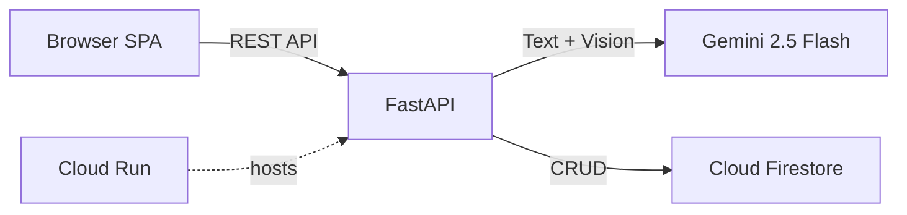

# FitTrack AI — Smart Fitness Companion

AI-powered fitness tracking platform with workout logging, nutrition tracking, food photo scanning, personalized coaching, and progress analytics.

**Built for Google Build with AI — 2nd Innings Challenge (Challenge 2)**

## Tech Stack

| Layer    | Technology                                     |
| -------- | ---------------------------------------------- |
| Backend  | FastAPI (Python)                               |
| AI       | Gemini 2.5 Flash (Text + Vision) via Vertex AI |
| Database | Cloud Firestore                                |
| Hosting  | Google Cloud Run                               |
| Frontend | Vanilla HTML/CSS/JS SPA                        |

## Architecture



## Features

- **Workout Tracking**: Log workouts by type, duration & intensity with auto calorie estimation
- **Nutrition Logger**: Manual meal logging with full macro breakdown
- **AI Food Scanner**: Snap a photo → Gemini Vision analyzes calories & macros
- **AI Coach Chat**: Personalized fitness advice powered by Gemini
- **Progress Dashboard**: SVG rings, streaks, weekly charts, daily check-ins
- **Goal Setting**: Calorie, water, workout & weight targets with adaptive suggestions
- **Cloud Synced**: Per-user data in Firestore, accessible from any device

## Setup

```bash
cd fit_track
pip install -r requirements.txt

# Set GCP credentials (Application Default Credentials)
gcloud auth application-default login

# Run locally
uvicorn main:app --reload --port 8080
```

Open `http://localhost:8080`

## Deploy to Cloud Run

```bash
gcloud run deploy fit-track-ai \
  --source . \
  --region us-central1 \
  --allow-unauthenticated
```

## API Endpoints

| Method | Path                     | Description          |
| ------ | ------------------------ | -------------------- |
| POST   | /api/auth/register       | Create account       |
| POST   | /api/auth/login          | Sign in              |
| GET    | /api/dashboard/{id}      | Full dashboard data  |
| POST   | /api/workout             | Log workout          |
| POST   | /api/meal                | Log meal             |
| POST   | /api/meal/scan           | AI food photo scan   |
| POST   | /api/ai/chat             | AI coach chat        |
| GET    | /api/ai/suggestions/{id} | Adaptive suggestions |
| POST   | /api/daily-log           | Save daily check-in  |

## GCP Project

Shares GCP project `build-with-ai-fan` with FanZone AI. Firestore collections use `ft_` prefix to avoid collision.
